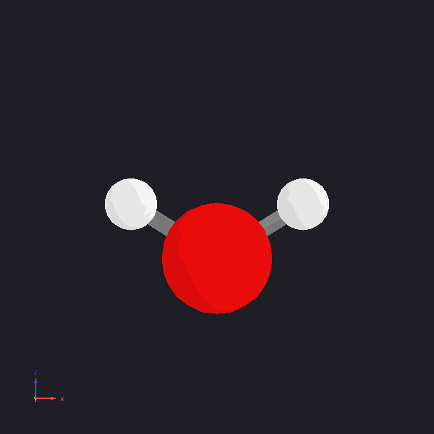

# vibview

[](https://kubrian.github.io/vibview)
[](https://www.python.org/downloads/)
[](LICENSE)
[](https://www.qt.io/)
[](https://vispy.org/)
[](https://www.hdfgroup.org/)

Vibrational mode visualization tool for computational chemistry.

## Demo



## Install

```bash
# via pip (GitHub)
pip install git+https://github.com/kubrian/vibview.git

# via pixi (development)
git clone https://github.com/kubrian/vibview.git
cd vibview
pixi install
pixi shell
```

Requires Python 3.10+.

## Quick start

```bash
# Launch the interactive viewer with the bundled H₂O example
vibview view

# Export an animation (use the GUI or convert then export)
# Assumes water.hess is an ORCA Hessian file in the current directory
vibview convert water.hess orca -o water.h5
vibview export water.h5 native --format gif --name anim

# Search for available commands and options
vibview --help
vibview view --help
```

## Features

- **Three visualization modes**: animated vibration, static displacement arrows, wireframe diff overlay
- **GUI viewer**: drag to rotate, scroll to zoom, mode selector
- **Export**: render frames as PNG sequence, GIF, or MP4
- **Format conversion**: convert Orca/phonopy output to compact native HDF5
- **Parser support**: Orca `.hess`, phonopy `band.yaml`/`mesh.yaml`, native HDF5
- **Solid-state capable**: multi‑q‑point crystal data with lattice rendering
- **Configurable**: YAML cascade with CLI overrides for colors, radii, animation parameters

## Documentation

- [Usage guide](https://kubrian.github.io/vibview): full CLI reference, configuration, examples
- [Design & rationale](https://kubrian.github.io/vibview/design): architecture decisions and data model
- [API Reference](https://kubrian.github.io/vibview/api): auto-generated from docstrings
- Run `vibview --help` for all commands and options.

## Contributing

See [CONTRIBUTING.md](CONTRIBUTING.md) for development setup, coding conventions, and the pull request process.

## Changelog

See [CHANGELOG.md](CHANGELOG.md) for version history.

## License

GNU General Public License v3.0. See [LICENSE](LICENSE).
